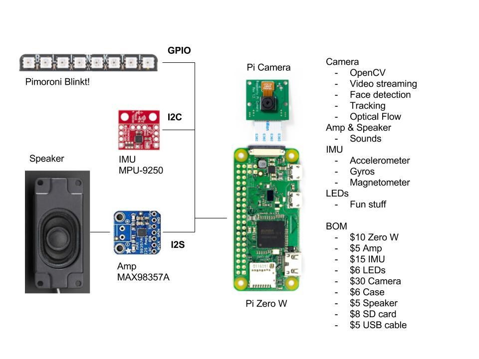

# mote

**Still in development -- not functional yet**

simple IoT robot. Currently travis-ci fails to build this for Python 3, but
eventually I would like to make it compatable. It however, does work with
Python 2.7 (not that it does much right this minute) :smile:

Mote's primary use is for teaching students about embedded systems and robotics.
To that end, mote has:

- Jupyter notebook installed and always running
- Useful development tools like: gcc/g++, git, cmake, pkg-config, etc
- OpenCV 3.2.x installed
- Python 2.7 and 3.6 installed with developer libraries
	- `pip` and `pip3` also installed
- Samba installed and setup
- WiFi, Bluetooth, and SSH enabled
- Interfaces setup: I2C, SPI, and I2C
- Basic admintools added:
	- `nmap` - to map local network
	- `arp-scan` - to map local network
	- `htop` - to see process running
	- `pyarchey/hostinfo` - to see if your mote is up and running
- Other software
	- [maybe] `pygecko` - robotics libraries
	- [maybe] `opencvutils` - opencv utilities
	- [maybe] `mjpeg` - stream camera images

## Install

For development you can also do:

    git clone https://github.com/walchko/mote.git
    cd mote
    pip install -U -r requirements.txt

# Licenses

## Software: MIT License

Copyright (c) 2017 Kevin J. Walchko

Permission is hereby granted, free of charge, to any person obtaining a copy of
this software and associated documentation files (the "Software"), to deal in
the Software without restriction, including without limitation the rights to
use, copy, modify, merge, publish, distribute, sublicense, and/or sell copies
of the Software, and to permit persons to whom the Software is furnished to do
so, subject to the following conditions:

The above copyright notice and this permission notice shall be included in all
copies or substantial portions of the Software.

THE SOFTWARE IS PROVIDED "AS IS", WITHOUT WARRANTY OF ANY KIND, EXPRESS OR
IMPLIED, INCLUDING BUT NOT LIMITED TO THE WARRANTIES OF MERCHANTABILITY, FITNESS
FOR A PARTICULAR PURPOSE AND NONINFRINGEMENT. IN NO EVENT SHALL THE AUTHORS OR
COPYRIGHT HOLDERS BE LIABLE FOR ANY CLAIM, DAMAGES OR OTHER LIABILITY, WHETHER
IN AN ACTION OF CONTRACT, TORT OR OTHERWISE, ARISING FROM, OUT OF OR IN
CONNECTION WITH THE SOFTWARE OR THE USE OR OTHER DEALINGS IN THE SOFTWARE.

## Documentation: Community Commons

	
	 This work is licensed under a <a rel="license" href="http://creativecommons.org/licenses/by-sa/4.0/">Creative Commons Attribution-ShareAlike 4.0 International License</a>.

