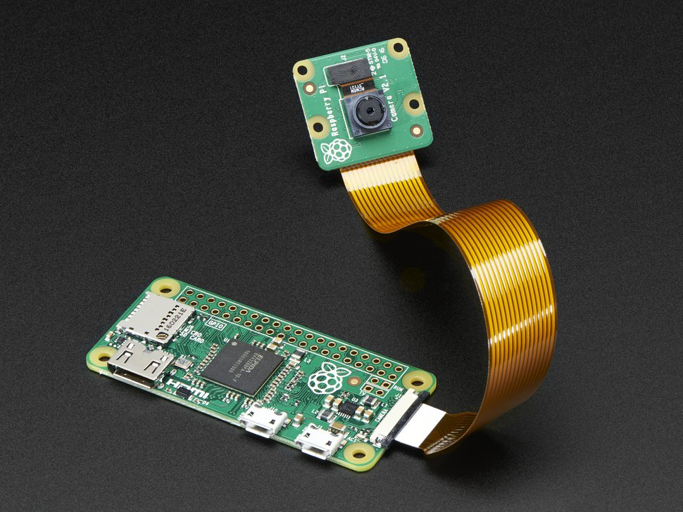

# Raspberry Pi Camera

It can be confusing how to install the ribbon cable, but putting the tin leads of the 
ribbon cable facing the green PCB (see picture) and the white (or blue) backing facing
away from the PCB.
