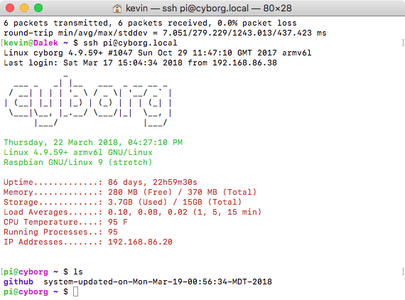

# Setup

After you burn a new copy of Raspbian Lite to an SD card, do:

- `touch /boot/ssh`
- create a `/boot/wpa_supplicant.conf` file so the RPi will automaticaly join a wifi network when it boots

Here is the format for 2 networks, with priorities set for which one to join if both are found:

```bash
ctrl_interface=DIR=/var/run/wpa_supplicant GROUP=netdev

network={
    ssid="SSID-1"
    psk="password-1"
    key_mgmt=WPA-PSK
    proto=WPA2
    priority=1
}

network={
    ssid="SSID-2"
    psk="password-2"
    key_mgmt=WPA-PSK
    proto=WPA2
    priority=2
}
```

Note, after boot, this file is moved from `/boot` to `/etc/` where it belongs.

# Software Setup

These scripts are to help setup a new raspbian system. Once you `ssh` in, update the system:

    sudo apt-get update
    sudo apt-get -y upgrade
    sudo apt-get -y install git

Get a copy of this software one of two ways:

    mkdir github
    cd github
    git clone https://github.com/MomsFriendlyRobotCompany/mote.git # if you don't have write access to my repo
    git clone git@github.com:MomsFriendlyRobotCompany/mote.git     # if you are me

Now go into the software directory and install/setup everything:

    sudo ./install.sh
    sudo ./setup.sh <hostname> <wifi-ssid> <wifi-password>

# Optional Setup

## Optional auto-updates



This will create a service that runs weekly to update: `apt-get`, `pip`, `pip3`,
`npm`. If you want, you could also add `rpi-update` to the script and update
the kernel weekly too (not sure that is a great idea though). After an update has
occurred, a text file is created with the time/date of the update (see image
above).

	sudo ./setup-auto-upgrade.sh

## Optional with `sudo`

I can't make this automatic, you **must** input a password from the command line
so I made it optional.

    sudo ./setup-smb.sh  # you will be asked for a SMB password, just use raspberry

## Optional as `pi`

Just makes working with `git` nicer.

    ./setup-git.sh <github-username>
    ./setup-ssh.sh

# Bypass known_hosts

Since all RPi's hostname are raspberrypi.local, it **sucks** when you try to connect
to a new one and you get the man-in-the-middle attack warning.

You can disable the check with:

    ssh -o UserKnownHostsFile=/dev/null pi@raspberrypi.local

# What is happending?

Both of the scripts `install.sh` and `setup.sh` are calling subscripts like
`install-python.sh`. Originally these were big monolithic scripts, but from time
to time, I only needed a part of the script. So now they are broken out, so if
all you need is to setup smb, just run the `setup-smb.sh` and you are done.

# Old Jessie Issue

## ffmpeg Issue

Debian (morons) removed ffmpeg from the distro, so you have to add another repo
to get it. If you get the following error when trying to update:

    W: GPG error: http://www.deb-multimedia.org jessie InRelease: The following signatures couldn't be verified because the public key is not available: NO_PUBKEY 5C808C2B65558117

Try this:

    sudo apt-get install deb-multimedia-keyring

That should fix it.
